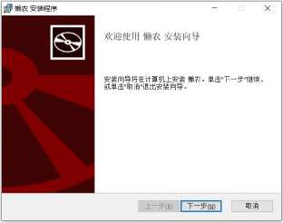
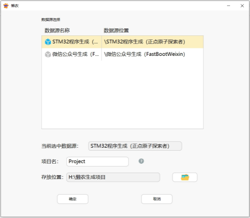
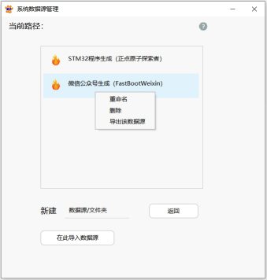

# 懒农 （LazyCoder）

## 一款实现可视化生成代码的代码生成器

&emsp; &emsp;

### 📖 概述

&emsp; &emsp;懒农是一款实现可视化生成代码的代码生成器，如示例动图，使用懒农，可通过添加功能以及图示的可视化操作，实现即时代码生成和修改。

<a id="example1">示例</a>

&emsp; &emsp;but。。。

&emsp; &emsp;实际上，这软件一行代码也不会生成

&emsp; &emsp;它能实现像[图示](#example1)所示的效果，是因为在使用软件生成代码之前，导入了对应的数据文件。

&emsp; &emsp;如上图所示，这两个文件为客户端附带的示例数据文件，导入对应的示例数据文件后，便可使用该数据文件通过可视化操作生成对应源码，[图示](#example1)所示的操作为使用&emsp; &emsp;_STM32程序生成（正点原子探索者）_ 这个数据文件([客户端下载链接](#example2))生成的源码的示例。该数据文件生成的代码内容基本取自于STM32开发板厂商正点原子公开的探索者开发板裸机源码，使用该数据源可以通过可视化生成对应的电路控制程序。同样，要生成其他代码，也需要开发者针对某种业务场景，将所需生成的代码等内容做成数据文件，例如示例数据源的 _微信公众号生成（FastBootWeixin）_ 数据文件([客户端下载链接](#example2))，该数据文件可使用java语言快速生成一个简易的微信公众号相关程序 _（该生成源码仅作示范使用，不考虑实际用途，因为实际情况几乎可以说没人会这样做微信公众号开发）_ 。由于这种生成代码的思路并不涉及具体的编程语言，所以可以适应于多种编程语言。

&emsp; &emsp;在制作数据文件的过程中，需要录入生成项目源码的固定文件结构等内容，如上图所示，除了要录入需要生成的代码文件内容，以及可以选择添加的功能的代码以外，还要编辑可以对代码进行可视化操作的操作层。录入对应的文字，并添加合适的控制组件。在使用数据文件生成源码时，客户端会根据录入内容生成对应源码和可以对其进行可视化操作的控制台，从而让用户可以根据控制台的文字内容和组件，按提示进行操作对代码进行更改，并通过提供的各种功能的选择组合生成自己所需要的代码。&emsp; &emsp;

### ⌨️ 这代码生成器能用来生成什么代码
&emsp; &emsp;看到这里，可能不少人会觉得，这样的软件并没有什么太大的作用，这样生成代码的方式，没法应用于复杂的开发工作中。其实，这款软件，其最终的应用目的，是希望能提供给懂得一般电脑操作的人，用来生成自己所需要的一些简易程序的。

&emsp; &emsp;有时候，对于很多人来说，有些需要进行人工进行的简易繁复的工作可以用程序来进行代替，这类程序往往没有复杂的程序逻辑，仅是实现某些简单的功能来解决一些实际需求，但这类程序往往没什么经济价值。说得通俗点，用户也不会想到要搞个程序来完成工作，找人也肯定不现实，不舍得花太多钱，哪怕真有开发者愿意为其进行开发需要的程序，也容易出现由于用户无法理解技术，或者开发者没能理解用户实际需求的情况，导致双方沟通存在问题，最终实现的效果没能满足用户的实际需求；或者说在使用过程中由于实际外部因素的改变，导致原来生成的程序需要调整才能满足实际情况。此外，像这类需求，由于不同的用户和不同需要，也要通过实际情况来判断和辨别，应该需要什么技术领域以及符合的编程语言，找具备对应技能的开发者进行定制化开发才能解决问题 _（比如适合于web服务一类的需求，总不能找具备嵌入式开发功能的人来处理）_ ，而这对于用户而言，是他们难以靠自身能力来完成的。

&emsp; &emsp;所以，对于这样一类难以产生巨大经济价值的需求，按照以往用户支付费用，并根据自身需求通过和开发者之间的沟通来满足用户的个性化需求，进行定制化软件开发的方式，无法切合实际情况。笔者开发该应用，也是想通过这款软件，提供一种协作方式，开发者围绕某种业务场景制作对应的数据文件提供用户进行可视化代码生成，当数据文件达到一定数量，用户可以根据自己的需求，通过一定方式找到自己所需的数据文件，并在开发者的引导下，使用数据文件生成所需代码。 _（当然，有些代码并不适合通过这种方式生成，要解决该问题需对软件继续进行迭代改进。）_ 由于这软件生成代码的思路并不涉及任何编程语言，所以当数据文件的数量和种类达到一定数量时，通过这种方式可生成多个领域和不同的编程语言的简易代码，如嵌入式应用程序、web服务程序等，从而在种类、数量、功能、业务场景上对用户需求进行覆盖，一定程度上满足这类一般用户所需的简易程序开发需求。

&emsp; &emsp;以嵌入式应用程序为例，各位可使用本应用软件附带的示例数据文件 _STM32程序生成（正点原子探索者）_ 数据文件([客户端下载链接](#example2))示例生成代码实际体验，该数据文件大部分生成源码是直接使用正点原子公开的探索者开发板源码制作，使用懒农可通过可视化的方式生成对应的裸机源码。生成源码后，经过编译、烧录到开发板或者对应的硬件电路，便可实现相应的功能。

&emsp; &emsp;看到这里，可能会有人觉得，懒农的做法根本是不切实际，不谈其他，单是像这类硬件电路的控制程序，相对于程序设计，其中的硬件电路设计到成品制作等所需的相关知识和技能，比程序编写本身的难度更大 ，生成程序以后，后续到最终成品实现的过程中，需要具备对应知识和技能的工作，根本不是一个只懂得一般操作的用户能够实现的，仅以这种方式生成代码，而不是用户最终所需的成品硬件，就想满足用户的需求根本就是空谈。

&emsp; &emsp;诚然，对于生成所需的成品实物，仅生成代码远远不够，但是，能确定要生成的代码以后，不考虑电路布局等因素，其成品实物的硬件设计电路基本可以确定。而且对于这个领域，终端用户所需的需求对应技术基本是消费电子行业所需的板级硬件技术，板级硬件技术随着这么多年行业的发展，早已实现了模块化和集成化，对于一些并不算过于复杂的功能需求，仅从实现功能的角度考虑，很大程度上可以当成编译后烧录到对应MCU，并根据生成代码将各模块电路进行连接的事。如果数据文件可以生成可应用于实际的代码，通过这样的方式，开发者也可以以一种相对较低的成本提供后续的使用引导等工作。即便在这过程中用户可能存在一些问题难以自己解决，但其实只要这类需求能通过这样的方式得以整合，并形成经济价值，凭借目前的技术，当代码生成时，即所需条件已经明确后，也可以通过现有的技术手段去有针对性的对该类问题提供更为简易操作的方式供用户完成。就好比如今的修图和短视频编辑等，在面对终端用户特定的需求的情况下，可以提供简单易用的功能，以产品的形式让用户实现想要的效果，而不是一味地要求用户需要具备相应的技能。

&emsp; &emsp;同样，对于web服务或者传统的客户端开发，由于CS架构和BS架构之间没有过于明确的技术划分；随着目前众多开源技术的涌现让开发的成本和难度降低；而且现在有众多的第三方互联网服务提供各种丰富的基础功能；对于像UI或者某些特定的代码，早已有可以进行可视化生成或者简易配置生成的工具可以实现；对于一般用户日常所需的一些并不复杂的单一功能需求，通过事先围绕特定业务场景编写的数据文件，以可视化的方式生成基本代码框架，对于一些不适合使用数据文件生成的代码，以结合其他工具配合生成，从当前技术的角度来说，一定程度上，目前已经具备实现的可能。而且，使用数据文件的方式，还可以让开发者能事先确认生成的代码所需要的环境，这样也可以进一步让快速编译和部署等工作有了实现的可能。笔者通过懒农所想要实现的，不仅仅是这个软件所表现的可视化生成简易程序的效果，而是希望可以以这个软件作为起点，通过现有技术等方面的整合和协作方式的改变，让技术得以进一步下沉，使得这类简易的应用程序需求得以快速实现，具备并整合为市场需求形成经济价值的可能。&emsp; &emsp;

### 💻 ChatGPT等大模型都出来了，通过这种方式来实现这效果还有必要吗
&emsp; &emsp;目前，人工智能技术已经取得了重大进展，在ChatGPT正式问世后，各类AI产品如雨后春笋一样出现，其重要性的发挥也在影响着全球各行各业的人们。或许会有人认为，像笔者所想要实现的效果，像ChatGPT等大模型现在已经能够满足笔者所提及的需求，没必要使用按照笔者的方式生成代码。对此，笔者认为，ChatGPT等大模型即便可以对世界产生巨大改变，但其不管作用在哪个领域，也必然是在与现有社会的相应资源深度结合才能发挥作用的。通过对话式交互的方式，在代码生成方面确实提高了开发效率，并极大的降低了开发的难度。但对于一些只会一般的电脑操作的用户而言，他们对于编程的认识可以说基本为零，在通过对话式的沟通过程中，一方面，用户的表达过程中可能始终停留在其想要实现的效果或者需要解决的问题这个阶段，甚至说根本不知道编程能为他们做什么，而无法将所需要解决的问题转为实际的应用功能需求。在真正的强人工智能到来之际，应该说无论大模型等技术再怎么发展，它应该也只能从技术上把目前编程技术的难度和使用成本降低，解决在技术上所能涉及的问题。而对于像用户这类由于自身认知不足所导致的需求无法明确的问题，是需要针对这类实际情况，通过方式的改变，提供一种让用户所能适应的、并且可以低成本的形式去满足他们所需、总体上可形成产品的方案才能解决。通过可视化、对话式生成、或者类似于搭积木等形式，都是解决这类问题的手段。通过懒农去对技术等方面进行整合，为用户提供一种和此类需求相匹配的协作方式去降低其实现成本来解决此类问题，未尝不是一种合适的途径。

&emsp; &emsp;另外，编程是一个极其广泛的概念，面对不同的问题和需求等实际情况，其需要使用不同的编程语言以及所需要的领域所涉及的技术。使用数据文件的方式，还可以再使用技术或者其他形式，让用户可以根据自己的实际需求找到相符合的数据文件，进而可以通过数据文件来确定需求所对应的编程语言和涉及领域、所使用的技术栈等。当这些可以确定以后，才有更进一步的可能，为用户对生成代码后的后续编译、部署等等直至最终程序能成功运行所需的一系列工作，在技术上或者协作方式上提供简易快捷完成的可能。此外，对于生成的代码，有时候会由于实际环境等条件的改变，需要对生成代码进行更改和调整，使用像懒农这样的生成代码的方式，也有利于对生成代码随时进行更改和调整。大模型等人工智能技术的出现，不见得是彻底抛弃了这样的方式来提供更高效率的方式生成代码，也可以在技术上为这个过程的实现提供更为智能化的技术支撑。&emsp; &emsp;

·

### 生成代码操作指引

#### 📦 安装说明

运行安装包，点击【下一步】。

注意到这里选择安装路径的时候不要安装默认路径安装，要重新选择安装路径，否则软件安装后无法运行，安装路径不能有空格或者特殊符号。

比如将安装路径改为“D:\LazyCoder\”，然后点击【下一步】。

点击【安装】。

然后等待程序安装完成即可。

&emsp; &emsp;

#### 生成代码使用引导
使用懒农生成软件，首先需要导入数据文件，以下以导入示例数据文件为例说明。

点击【懒农数据源】

点击【在此导入数据源】，按提示将数据文件导入，每次只能导入一个数据源，导入完成以后退出软件

再打开软件，点击【生成程序】

选择要用来生成代码的数据文件，填写项目名，并设置项目文件存放路径，点击【确定】

稍微等待一会，进入代码生成界面，鼠标放在左上角中已选择的模块，可以添加对应模块的功能到当前橙色的面板上，中间为可视化控制面板，通过里面文字和组件结合，按提示操作对代码进行调整，其中里面有个带有蓝色的“…”图形的按钮，点击可以展开对应的面板，并使得该面板为橙色。

点击【生成源码】，即可生成对应代码文件，项目文件的源码文件夹里面的就是生成源码，使用文档文件夹里面为使用该数据文件生成代码的使用引导文档。

&emsp; &emsp;

#### 制作数据文件使用引导

点击【懒农数据源】。

在新建 【数据源/文件夹】处选择【数据源】，输入数据源的名字，点击【确定】，即可创建数据文件，双击对应数据文件可进入编辑界面进行内容编辑，具体操作可在每个界面上点击附近的【?】按钮查看操作指引，或者询问笔者。

&emsp; &emsp;

#### 导出数据文件

点击【懒农数据源】。

找到需要导出的数据文件，点击【导出该数据源】，按提示操作即可

&emsp; &emsp;

### ☎️ 联系作者
项目开源地址
[github](https://github.com/LazyCoder0101/LazyCoder)
&emsp;
[gitee](https://gitee.com/lazy-coder/LazyCoder)
&emsp; &emsp;
- 如果您对懒农这个应用，想要反馈 Bug、提供产品意见，甚至进行迭代优化，欢迎联系作者，或者加群讨论。

<table>
<tr>
<td align="center"> <b>作者qq</b></a>
<td align="center"> <b>作者微信</b></a>
<td align="center"> <b>qq群：893613856</b></a>
</tr>
</table>

### 📦 ️ 客户端下载地址
<a id="example2">客户端下载地址</a>

⭐ [客户端百度云链接](https://pan.baidu.com/s/10NHwZAf4JBDj7uZG7yiXDw?pwd=qt50)		提取码：qt50

⭐ [客户端蓝奏云链接](https://wwze.lanzoub.com/b052o8jgf)	提取码：2kim

⭐ [客户端阿里云盘链接](https://www.alipan.com/s/CE3ghFLWz2C)

> 🤭记得点个小星星Starred