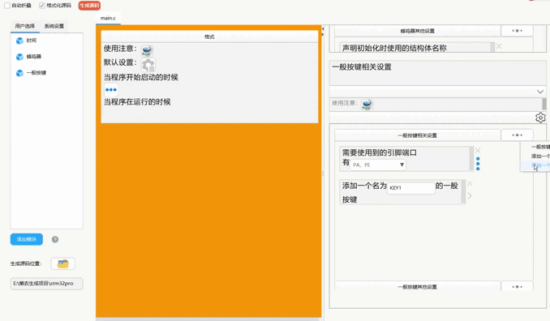
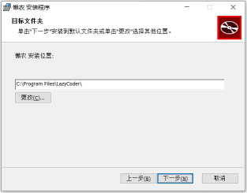
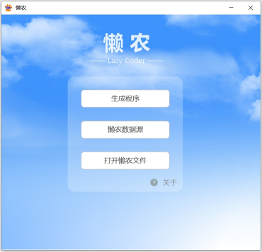
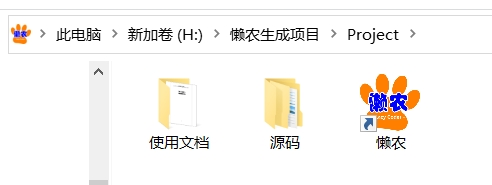
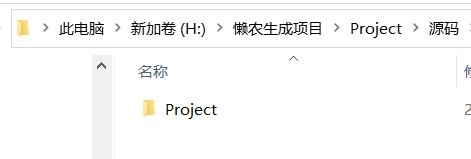

# 懒农 （LazyCoder）

## 一款实现可视化生成代码的代码生成器

&emsp; &emsp;

### 📖 项目概述

&emsp; &emsp;懒农是一款为只懂得一般电脑操作的用户开发的一款代码生成器，通过懒农提供的可视化操作，可快速生成一些功能并不复杂的应用程序代码，降低开发成本。

&emsp; &emsp;如 ___STM32生成代码示例___ （上图）所示，懒农提供一系列可视化操作，只需通过功能的添加，并按照文字内容和组件的提示进行内容调整，即可生成所需代码。

&emsp; &emsp;此外，懒农可生成多种编程语言和不同领域的代码，上图所示生成的是使用STM32微控制器进行电路控制的嵌入式应用程序（内容大部分照搬正点原子厂商公开源码）。

&emsp; &emsp; ___微信公众号生成代码示例___ （上图）所示生成的是使用java生成搭建微信公众号的简易示例（使用开源框架fastboot）。
&emsp; &emsp;虽然懒农的设计初衷是为不具备深入编程技能的用户提供帮助，但这篇文档将向开发者介绍懒农的工作原理，以便更好地理解代码生成的方式，并期待开发者的参与。

### ⌨️ 生成思路说明

&emsp; &emsp;懒农并不直接生成代码。实际上，它依赖于数据文件。需要开发者根据特定应用场景制作对应的数据文件，用户只需导入这些数据文件，即可通过可视化界面生成代码。

&emsp; &emsp;前面所示通过可视化操作生成的STM32的嵌入式程序以及搭建简易公众号的程序，是作者制作了2个作为示例使用的数据文件，用户导入对应的数据文件后，便可通过对应数据文件生成所需的程序。同样，要生成其他的程序，也需要开发者使用懒农制作对应的数据文件。

  
 <b>🡾▶ 应用开发的目的和意义</b>

&emsp; &emsp;懒农的目标是为那些不具备深入编程技能的用户提供帮助，并尝试通过这种方式，降低一些需求的实现成本。有时候，我们遇到一些繁琐的机械化工作，完全可以通过程序来代替。这些程序通常不需要复杂的逻辑，只需实现简单功能以满足实际需求。然而，这类程序并没有太大的经济价值，用户基本也不会为它花费过多的费用，而且如果通过像以往通过用户和开发者进行沟通的方式来进行定制化开发制作，也容易出现由于沟通或者理解不清楚而带来成品最终效果无法满足实际需求等情况，懒农正是为这类用户的类似需求而设计的。

&emsp; &emsp;虽然这些需求可能没有巨大的经济价值，但懒农的协作方式可以降低开发成本。开发者围绕着某种应用场景制作数据文件，用户找到合适的数据文件后，根据需求生成代码。当数据文件种类丰富时，懒农将覆盖多个领域和编程语言，满足一般用户的简易程序开发需求。而且，如果一个数据文件可以让终端用户应用到实际用途，可以持续用于生成代码，便能在后续用户的使用中，让数据文件的开发者作者可以以一种相对较低的开发成本，并付出一定合适的售后服务成本的方式，满足用户此类需求，以创造价值。

&emsp; &emsp;当然，懒农并不是万能的。它更适用于生成简易程序，而不是复杂的应用。但随着以后项目的发展和迭代更新，以及数据文件的丰富还有人工智能技术等应用，懒农有望更进一步实现地覆盖、并满足更多的用户需求。

&emsp; &emsp;懒农并不是解决最终成品实物的方法，但它为用户提供了一种快速生成代码的途径。当生成代码可以通过数据文件作者预先知悉以后，后续的编译、部署等环节也可以由数据文件作者进行引导，甚至可以进一步提供快速完成的可能性。作者想通过懒农提供的，不仅仅是一个代码生成器，更是想通过懒农这个应用的发展，在一定条件下进行现有技术的整合，以更进一步降低软件开发的成本，并带来一种协作方式的改变，让现有的编程技术的应用可以进一步的下沉，使得这类简易的应用程序需求得以快速实现，得以整合并具备成为市场需求，形成经济价值的可能。

> ### 生成代码操作指引

> > #### 📦 安装说明

运行安装包，点击【下一步】。

注意到这里选择安装路径的时候不要安装默认路径安装，要重新选择安装路径，否则软件安装后无法运行，安装路径不能有空格或者特殊符号，最好不要安装在C盘。

比如将安装路径改为“D:\LazyCoder\”，然后点击【下一步】。

点击【安装】。

然后等待程序安装完成即可。

&emsp; &emsp;

> > #### 生成代码使用引导

使用懒农生成软件，首先需要导入数据文件，以下以导入示例数据文件为例说明。

点击【懒农数据源】

点击【在此导入数据源】，按提示将数据文件导入，每次只能导入一个数据源，导入完成以后退出软件

再打开软件，点击【生成程序】

选择要用来生成代码的数据文件，填写项目名，并设置项目文件存放路径，点击【确定】

选择所需模块，然后点击确定

稍微等待一会，进入代码生成界面，鼠标放在左上角中已选择的模块，可以添加对应模块的功能到当前橙色的面板上，中间为可视化控制面板，通过里面文字和组件结合，按提示操作对代码进行调整，其中里面有个带有蓝色的“…”图形的按钮，点击可以展开对应的面板，并使得该面板为橙色。

点击【生成源码】，即可生成对应代码文件，项目文件的源码文件夹里面的就是生成源码，使用文档文件夹里面为使用该数据文件生成代码的使用引导文档。

&emsp; &emsp;

> > > #### 制作数据文件使用引导

点击【懒农数据源】。

在新建 【数据源/文件夹】处选择【数据源】，输入数据源的名字，点击【确定】，即可创建数据文件，双击对应数据文件可进入编辑界面进行内容编辑，具体操作可在每个界面上点击附近的【?】按钮查看操作指引，或者询问笔者。

&emsp; &emsp;

> > > #### 导出数据文件

点击【懒农数据源】。

找到需要导出的数据文件，点击【导出该数据源】，按提示操作即可

&emsp; &emsp;

### ☎️ 联系作者

项目开源地址
[github](https://github.com/LazyCoder0101/LazyCoder)
&emsp;
[gitee](https://gitee.com/lazy-coder/LazyCoder)
&emsp; &emsp;

- 如果您对懒农这个应用，想要反馈 Bug、提供产品意见，甚至进行迭代优化，欢迎联系作者，或者加群讨论。

<table>
<tr>
<td align="center"> <b>作者qq：3606515004</b></a>
<td align="center"> <b>作者微信：lanzai2020</b></a>
<td align="center"> <b>qq交流群：893613856</b></a>
</tr>
</table>

### 📦 ️ 客户端下载地址

<a id="example2">客户端下载地址</a>

⭐ [客户端百度云链接](https://pan.baidu.com/s/1qyNaiE02FNFwEKG3r_ZTsg?pwd=yrxi)        提取码：yrxi

⭐ [客户端蓝奏云链接](https://wwt.lanzoue.com/b0538q4bi)    密码:6s7q

⭐ [客户端阿里云盘链接](https://www.alipan.com/s/RaeSEiJsGPu)

> 🤭记得点个小星星Starred